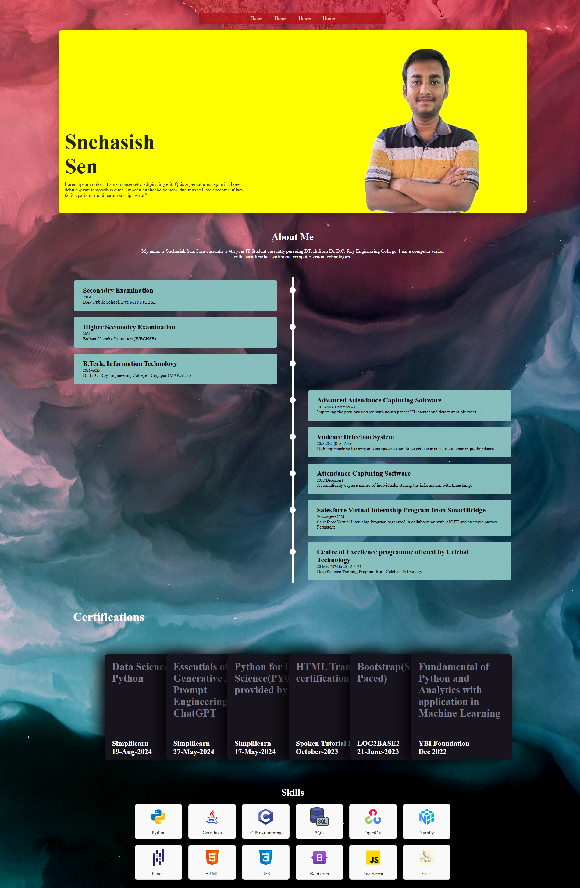

# Portfolio

## Overview
This is a simple portfolio website built using **HTML and CSS**. It showcases my projects, skills, and contact information.

## Features
- **About Me** – My name is Snehasish Sen. I am currently a 4th year IT Student currently pursuing BTech from Dr. B.C. Roy Engineering College. 
                I am a computer vision enthusiast familiar with some computer vision technologies.
- **Projects** – I have good repositories. 
- **Contact** – snehasishsen03@gmail.com

## Setup Instructions
1. Clone the repository:

   git clone https://github.com/Asish003/Portfolio.git